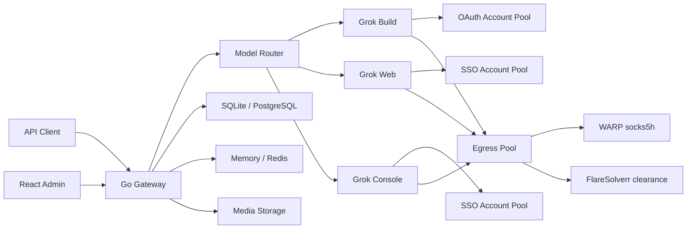

<p align="center">
  
</p>

<p align="center">
  <strong>面向 Grok Build、Grok Web 与 Grok Console 的多账号 API 网关</strong>
</p>

<p align="center">
  <a href="./backend/go.mod"></a>
  <a href="./frontend/package.json"></a>
  <a href="https://github.com/jiujiu532/grok2api-r0/actions/workflows/ghcr-image.yml"></a>
</p>

> [!NOTE]
> 本项目仅供学习与研究交流。请务必遵循 Grok 的使用条款及当地法律法规，不得用于非法用途！

Grok2API 是一个纯 Go 实现的 Grok API 网关。项目将 Grok Build OAuth、Grok Web SSO 与 Grok Console SSO 组织为独立账号池，对外提供 OpenAI 风格接口、Anthropic Messages 兼容接口，以及账号、模型、密钥、用量和代理管理后台。

本仓库（`jiujiu532/grok2api-r0`）在上游能力上额外强化了 **防封链路**（Client Hints、UA↔TLS 对齐、403 换出口、FlareSolverr/Clearance）与 **一键部署脚本**（WARP socks5h + FlareSolverr）。

## 功能概览

- **三 Provider**：`grok_build`、`grok_web` 与 `grok_console` 独立路由、额度和故障状态
- **标准接口**：Responses、Chat Completions、Images、异步 Videos、Anthropic Messages
- **多账号调度**：优先级、并发限制、额度门控、会话粘滞、冷却与故障切换
- **账号接入**：Device OAuth、OAuth JSON、SSO JSON、逐行 SSO Token
- **媒体能力**：图片生成、图片编辑、视频生成、图片本地归档与 URL/Base64 返回
- **出口与防封**：HTTP/SOCKS 代理池、WARP(socks5h)、FlareSolverr 刷 clearance、403 冷却换出口
- **基础设施**：SQLite/PostgreSQL、Memory/Redis
- **安全边界**：AES-256-GCM 凭据加密、客户端密钥哈希、日志脱敏、SSRF 与传输上限
- **管理后台**：Dashboard、账号、模型、客户端密钥、请求审计、接口文档与热加载设置

## 架构



典型防封链路：

```text
Client → Grok2API → socks5h://warp-N:1080 → WARP → Grok
                 ↖ FlareSolverr 用同一代理刷 cf_clearance 写回出口节点
```

---

## 部署方式

| 方式 | 适用 | 说明 |
| :-- | :-- | :-- |
| **A. 一键安装**（推荐） | Linux 服务器 | 一条命令拉脚本，装应用 + 可选 WARP/Flare |
| **B. Docker Compose** | 已有 compose 习惯 | 手动写 `config.yaml` |
| **C. 源码运行** | 开发调试 | Go + 可选 Vite |

> 前置：本机已安装 **Docker Engine** 与 **Compose**（脚本不安装 Docker）。  
> 镜像仅使用 **GHCR**：`ghcr.io/jiujiu532/grok2api-r0`（不推 Docker Hub）。

安装脚本从 **本仓库 raw 地址** 下载；应用更新只 **pull GHCR 镜像**。

---

### 方式 A：一键安装（推荐）

仓库已公开，**直接拉本仓库脚本**，无需 Gist、无需先 clone：

```bash
bash <(curl -fsSL https://raw.githubusercontent.com/jiujiu532/grok2api-r0/main/scripts/install.sh)
```

脚本文件：[`scripts/install.sh`](./scripts/install.sh)

> 请用 `bash <(curl …)`（不要用 `curl | bash`），菜单才能正常读键盘输入。  
> 应用镜像只从 **GHCR** 拉取：`ghcr.io/jiujiu532/grok2api-r0`。

#### 脚本会做什么

自动检测环境并显示菜单：

1. 检查 Docker / Compose  
2. **可选**部署 `WARP × N` + `FlareSolverr`  
3. 输入管理员账号密码、宿主机端口（默认 `8000`）  
4. 生成密钥与 `config.yaml`（写入 `/opt/grok2api`）  
5. 从 GHCR 拉镜像并启动  
6. 若装了 WARP+Flare：自动写入出口节点与 Clearance  

#### 子命令

```bash
# 再次打开菜单
bash <(curl -fsSL https://raw.githubusercontent.com/jiujiu532/grok2api-r0/main/scripts/install.sh)

# 或下载后使用
curl -fsSL https://raw.githubusercontent.com/jiujiu532/grok2api-r0/main/scripts/install.sh -o install.sh
bash install.sh install
bash install.sh status
bash install.sh update      # 只 pull GHCR 镜像
bash install.sh restart
bash install.sh proxy
bash install.sh logs
bash install.sh uninstall
```

#### 目录与网络

| 路径 / 名称 | 默认值 | 说明 |
| :-- | :-- | :-- |
| 应用目录 | `/opt/grok2api` | config、compose、凭据 |
| 代理目录 | `/opt/grok2api-proxy` | WARP + FlareSolverr |
| Docker 网络 | `grok2api_net` | 应用与代理互通 |
| 管理端 | `http://127.0.0.1:<端口>` | 默认 8000 |
| 凭据 | `/opt/grok2api/.bootstrap-credentials` | 权限 600 |

```bash
export GROK2API_IMAGE=ghcr.io/jiujiu532/grok2api-r0:latest   # 可选覆盖
bash <(curl -fsSL https://raw.githubusercontent.com/jiujiu532/grok2api-r0/main/scripts/install.sh)
```

#### 安装完成后你还需要

1. 打开管理端，用安装时输出的账号密码登录  
2. **上游账号** 导入 Grok Web / Build / Console  
3. **客户端密钥** 创建 `g2a_` API Key  
4. 建议改密，并从 `config.yaml` 删除 `bootstrapAdmin`  

若选了 WARP+Flare，出口与 Clearance 一般已自动写好（需 `curl` + `python3`）。

#### 5. 日常运维

```bash
bash scripts/install.sh status
bash scripts/install.sh logs
bash scripts/install.sh update      # 更新 Grok2API 镜像
bash scripts/install.sh restart     # 重启并尝试更换 WARP IP
bash scripts/install.sh proxy       # 重建代理池（改 WARP 数量等）
```

---

### 方式 B：Docker Compose

适合不想用安装脚本、自己管目录的场景。

#### 1. 准备配置

```bash
git clone https://github.com/jiujiu532/grok2api-r0.git
cd grok2api-r0
cp config.example.yaml config.yaml
```

#### 2. 填写密钥

```bash
openssl rand -hex 32      # → secrets.jwtSecret
openssl rand -base64 32   # → secrets.credentialEncryptionKey
```

```yaml
secrets:
  jwtSecret: "替换为 hex 随机值"
  credentialEncryptionKey: "替换为 Base64 随机密钥"

bootstrapAdmin:
  username: "admin"
  password: "替换为强密码"
```

#### 3. 启动（可用本仓库 CI 镜像）

```bash
export GROK2API_IMAGE=ghcr.io/jiujiu532/grok2api-r0:latest
export GROK2API_PORT=8000
docker compose pull
docker compose up -d
```

访问 `http://127.0.0.1:8000`。

Compose 将 `config.yaml` 只读挂载进容器，数据落在 `grok2api-data` 卷（SQLite + 本地媒体）。

```bash
docker compose logs -f grok2api
docker compose restart grok2api
docker compose down
```

#### 4. 可选：手动加 WARP

`docker-compose.yml` 内有 WARP 注释示例，取消注释后启动，再在管理端添加：

```text
socks5h://warp:1080
```

FlareSolverr 需自行部署到同一网络，Clearance 地址填 `http://flaresolverr:8191`。

更省事的代理部署请用 **方式 A** 的 `bash scripts/install.sh proxy`。

---

### 方式 C：源码运行（开发）

```bash
cp config.example.yaml config.yaml
# 同样必须改 secrets 与 bootstrapAdmin

# 后端
cd backend
go run ./cmd/grok2api

# 前端（另开终端）
cd frontend
pnpm install
pnpm dev
```

- 后端默认：`http://127.0.0.1:8000`  
- 前端开发：`http://127.0.0.1:5173`，API 代理到 8000  

---

## 首次使用（通用）

1. 使用 `bootstrapAdmin` / 安装脚本创建的管理员登录  
2. （若需要防封）配置 **出口代理** + **Clearance**（见上文方式 A 第 4 步）  
3. 在「上游账号」接入 Grok Build / Web / Console  
4. 等待额度与模型能力同步  
5. 在「模型管理」确认对外模型与启用状态  
6. 在「客户端密钥」创建 `g2a_` API Key  
7. 使用该密钥调用 `/v1/*`  

首次管理员创建后，建议修改密码并从 `config.yaml` 删除 `bootstrapAdmin`。  
**`credentialEncryptionKey` 必须长期保留**，更换后已有凭据无法解密。

---

## 账号来源

| Provider | 认证方式 | 主要能力 |
| :-- | :-- | :-- |
| Grok Build | Device OAuth、OAuth JSON | 原生 Responses、Chat、Messages、Billing、模型同步 |
| Grok Web | SSO JSON、逐行 SSO Token | Chat、Responses、Messages、图片、图片编辑、视频 |
| Grok Console | SSO JSON、逐行 SSO Token | 无状态 Responses、兼容 Chat 与 Messages |

Grok Build OAuth 支持按需续期。Grok Web / Console 的 SSO 不可自动续期，失效后需重新授权。

Grok Console 固定 `store: false`，不支持 `previous_response_id`、Response 查询/删除或 `/responses/compact`。多轮应回放完整输入与工具结果。

## 模型

对外模型名不带 Provider 前缀（如 `grok-4.5`）。内部用 `Build/`、`Web/`、`Console/` 区分来源。以管理端模型页或 `GET /v1/models` 为准。

Grok Web 内置模型示例：

| 模型 | 能力 | 最低等级 |
| :-- | :-- | :-- |
| `grok-chat-fast` | Chat / Responses / Messages | Basic |
| `grok-chat-auto` | Chat / Responses / Messages | Super |
| `grok-chat-expert` | Chat / Responses / Messages | Super |
| `grok-chat-heavy` | Chat / Responses / Messages | Heavy |
| `grok-imagine-image` | Fast 图片生成 | Basic |
| `grok-imagine-image-quality` | Quality 图片生成 | Super |
| `grok-imagine-image-edit` | 图片编辑 | Super |
| `grok-imagine-video` | 视频生成 | Super |

Grok Console 内置：`grok-4.3`、`grok-4.20-0309` 及其 reasoning / multi-agent 变体、`grok-build-0.1` 等。`grok-4.5` 不由 Console 注册。

## API

除健康检查和公开图片外，`/v1` 需要：

```http
Authorization: Bearer g2a_xxx_xxx
```

| 方法 | 路径 | 说明 |
| :-- | :-- | :-- |
| `GET` | `/healthz` | 存活检查 |
| `GET` | `/readyz` | 就绪检查 |
| `GET` | `/v1/models` | 可服务模型 |
| `POST` | `/v1/responses` | Responses JSON / SSE |
| `POST` | `/v1/chat/completions` | Chat Completions |
| `POST` | `/v1/messages` | Anthropic Messages |
| `POST` | `/v1/images/generations` | 图片生成 |
| `POST` | `/v1/images/edits` | 图片编辑 |
| `POST` | `/v1/videos/generations` | 创建视频任务 |
| `GET` | `/v1/videos/{request_id}` | 查询视频任务 |

```bash
export GROK2API_API_KEY="g2a_xxx_xxx"

curl http://127.0.0.1:8000/v1/responses \
  -H "Authorization: Bearer $GROK2API_API_KEY" \
  -H "Content-Type: application/json" \
  -d '{
    "model": "grok-chat-auto",
    "input": "用三句话解释量子隧穿",
    "stream": true
  }'
```

管理端登录后可在 `/docs` 查看示例。开发可设 `server.swaggerEnabled: true` 使用 `/swagger/index.html`（生产请关闭）。

## 配置与存储

根目录 `config.yaml`（启动配置）：

| 分组 | 说明 |
| :-- | :-- |
| `server` | 监听、请求体上限、超时、Swagger |
| `frontend` | 公开 API 地址、静态目录 |
| `database` | sqlite / postgres |
| `runtimeStore` | memory / redis |
| `auth` | 管理员 Token / Cookie |
| `secrets` | JWT 与凭据加密密钥 |
| `media` | 本地媒体路径 |

账号、模型、额度、审计、客户端密钥、**出口节点**、**Clearance/运行设置** 保存在数据库；除标注「重启生效」外，管理端修改可热加载。

| 场景 | 数据库 | 运行态 | 媒体 |
| :-- | :-- | :-- | :-- |
| 本地 / 单实例 | SQLite | Memory | 本地目录 |
| 多实例 | PostgreSQL | Redis | 共享卷或实例亲和 |

## 生产建议

- 外网用 HTTPS 反代到 `127.0.0.1:端口`，并设 `auth.secureCookies: true`
- 保持 `server.swaggerEnabled: false`
- 多实例用 PostgreSQL + Redis
- 备份 `config.yaml`、数据库与媒体目录；**加密密钥不可丢**
- 不要将 OAuth / SSO / CF Cookie / 账号导出提交到 Git
- 出口脏 IP 时用 WARP 池 + FlareSolverr（优先走安装脚本）

## 版本管理

**只改一个文件：[`VERSION`](./VERSION)**（语义化版本，无 `v` 前缀，如 `3.0.0`）。

其余位置会自动跟上来，不必手改多处：

| 消费者 | 如何自动同步 |
| :-- | :-- |
| Go（`go run` / 测试） | 启动时读取根目录 `VERSION` |
| Go 发布二进制 / Docker | 构建参数 / `-ldflags` 注入 `VERSION` |
| 管理 API | `GET /api/admin/v1/system` → `version` |
| 前端页脚 | Vite 构建时读根目录 `VERSION` |
| `package.json` / Swagger 展示字段 | `make sync-version` 或 `scripts/sync-version.sh` |
| GHCR 标签 | CI 读 `VERSION` → `3.0.0` / `latest` / `sha-…` |
| 安装脚本默认镜像 | `ghcr.io/jiujiu532/grok2api-r0:$(cat VERSION)` |

发版：

```bash
echo 3.0.1 > VERSION
make sync-version          # 把 package.json / swagger 展示字段对齐
git add -A && git commit -m "chore: release 3.0.1"
git tag v3.0.1 && git push && git push --tags
```

## 开发

```bash
make version

# 后端
cd backend
go test ./...
go test -race ./...
go vet ./...
make -C .. build-backend
./backend/grok2api --version

# 前端
cd frontend
pnpm install --frozen-lockfile
pnpm lint
pnpm build
```

CI：push 到 `main`/`master` 或打 `v*.*.*` 时读取 `VERSION` 构建多架构镜像。仅改 `**.md` / `scripts/**` 等不进镜像的路径不会触发构建。

## 进一步阅读

- [后端说明](./backend/README.md)
- [前端说明](./frontend/README.md)
- [安装脚本](./scripts/install.sh)
- [配置模板](./config.example.yaml)
